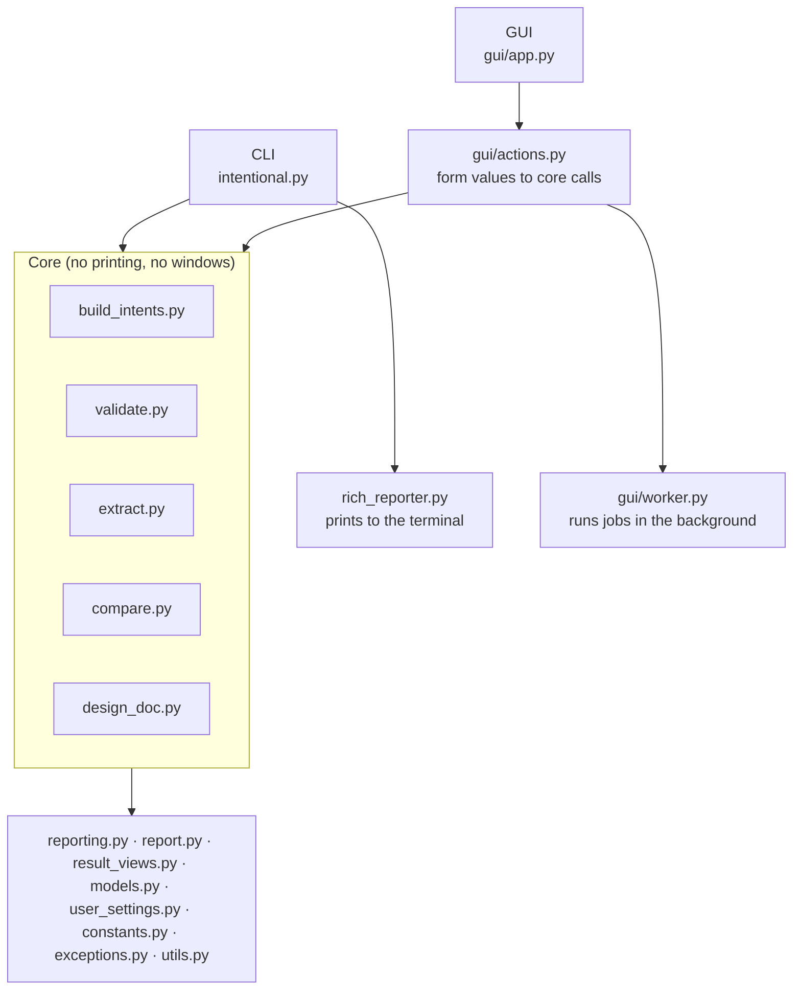
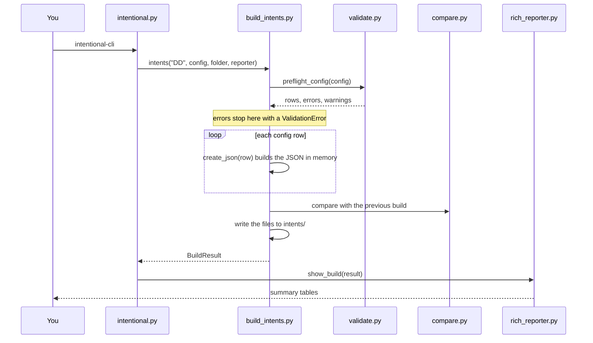

# Code Guide

A map of the source code: what each file does, how the files work together, and where to start reading. The code is split into small files so that each one has a single job; this guide shows how they fit together.

- [The big picture](#the-big-picture)
- [Where to start reading](#where-to-start-reading)
- [Files at a glance](#files-at-a-glance)
  - [Core: the work](#core-the-work)
  - [Shared definitions](#shared-definitions)
  - [Command line](#command-line)
  - [Graphical interface (gui folder)](#graphical-interface-gui-folder)
  - [Tests](#tests)
  - [Project files](#project-files)
- [Following one build through the code](#following-one-build-through-the-code)
- [Design ideas worth knowing](#design-ideas-worth-knowing)
- [Where to make common changes](#where-to-make-common-changes)

## The big picture

The code has three layers. The **core** does the work (reads configs and phrases, writes the intent JSON) and never prints anything or opens a window. The two **front ends**, the CLI and the GUI, collect the user's choices, call the core, and show the results in their own way.

Because the core doesn't print, the same code runs behind both front ends. It talks back through a **reporter** object that each front end supplies (see [Design ideas worth knowing](#design-ideas-worth-knowing)).

## Where to start reading

Read in this order to understand the program without getting lost:

1. [constants.py](../src/intentional_py/constants.py): the fixed values (folder names, languages, priorities). Short, and it explains the vocabulary.
2. [intentional.py](../src/intentional_py/intentional.py), the `main` function: what happens when you run `intentional-cli` with no command.
3. [build_intents.py](../src/intentional_py/build_intents.py), `intents()` and then `create_json()`: how one config row becomes intent JSON.
4. [validate.py](../src/intentional_py/validate.py), `check_rows()`: the rules every config row must pass.
5. [reporting.py](../src/intentional_py/reporting.py): the `Reporter` and the result objects that connect the core to the front ends.

After that, the other core files (extract, compare, design_doc) follow the same pattern, and the `gui` folder can be read on its own.

## Files at a glance

All the source is in `src/intentional_py`.

### Core: the work

| File | What it does |
|-|-|
| [build_intents.py](../src/intentional_py/build_intents.py) | **Builds the intents.** `intents()` checks the config, uses its English row or synthesizes one from the first available row, creates the JSON in memory, compares it with the previous build, optionally clears the old files, then writes the `intents` folder. `create_json()` turns one config row into intent and training-phrase JSON; `_generate()`'s `write_intent` flag makes only the first row for an intent+language (English first) own the shared intent definition, so a repeated intent+language row can swap in different phrases (its own usersays file) without changing the intent. `nl_config()` creates `intents_nl.cfg` from the NL phrase files. `compare_build()` does a build without writing, for Compare. |
| [validate.py](../src/intentional_py/validate.py) | **Checks configs and phrases.** `check_rows()` calls `models.ConfigRow.from_csv_row()` for the per-row rules (required fields, language, DTMF, machine learning), then handles the checks that need more than one row or the filesystem: an exact duplicate row is dropped, a same-intent-and-language row that differs is kept but warned about (see `build_intents.py`'s `write_intent`), duplicate phrases, the synthesized English row, and phrase files. The builds, the Validate task, the design document and the config editor all use it, so they always agree. `validate()` also checks that the folders and files exist. |
| [models.py](../src/intentional_py/models.py) | **A typed model of one config row.** `ConfigRow` is a Pydantic model with the same fatal-error/warning split as `check_rows()`; it never raises for a domain rule, only for a row that cannot be read at all (wrong column count). `check_rows()` uses it for every per-row check. `NamingRules` holds the intent/context naming convention, `ProjectLayout` holds the project folder/file names, and `NlDefaults` holds the default NL context (none a Dialogflow requirement) as overridable settings, each defaulting to the original hardcoded behavior; see `user_settings.py`. |
| [extract.py](../src/intentional_py/extract.py) | **Excel to phrase files.** `excel_data()` reads every sheet of a workbook, backs up the phrases it will replace to a zip, then writes one `.txt` file per sheet. |
| [compare.py](../src/intentional_py/compare.py) | **Finds the differences between two sets of intents.** `load()` reads an agent export (zip or folder) or an `intents` folder; `summarize()` reduces each intent to the fields this tool writes; `compare()` lists what was added, changed and removed. |
| [design_doc.py](../src/intentional_py/design_doc.py) | **Design document to config.** `config_from_design()` finds the header row in the Excel design document, copies each row to config format, backs up the old config and writes the new one. The Machine Learning value keeps the same meaning in both files. |

### Shared definitions

| File | What it does |
|-|-|
| [constants.py](../src/intentional_py/constants.py) | Fixed values used everywhere: default file and folder names, valid languages and modes, the priority table. Change a name here and it changes everywhere. |
| [exceptions.py](../src/intentional_py/exceptions.py) | The program's own error types, all based on `IntentionalException`. The front ends catch this one type to show a friendly message instead of a crash. |
| [reporting.py](../src/intentional_py/reporting.py) | The link between the core and the front ends. `Reporter` lists what the core may ask a front end to do (show a message or table, track progress, ask a yes/no question). The result classes (`BuildResult`, `ValidateResult`, …) are what each task returns. |
| [report.py](../src/intentional_py/report.py) | Writes a completed result, its issues and detail tables as a Markdown or CSV report. Both front ends call the same formatter. |
| [result_views.py](../src/intentional_py/result_views.py) | **The one place that reads a result's fields to decide what to show.** `summary_rows()`/`summary_tiles()`, `change_rows()`, `result_issues()`, `checks()` and `output_folder()` interpret `BuildResult`/`ExtractResult`/`ValidateResult`/`CompareResult`/`DesignResult` by `isinstance`. `report.py` and `gui/actions.py` both call these instead of each re-implementing the same `isinstance` checks, so the CLI report and the GUI tiles/issues can't quietly drift apart. Also defines the canonical `Result`/`Issue`/`Table` type aliases that `report.py` and `gui/actions.py` import rather than redefine. |
| [user_settings.py](../src/intentional_py/user_settings.py) | Loads and saves `NamingRules` (`naming_rules.json`), `ProjectLayout` (`project_layout.json`) and `NlDefaults` (`nl_defaults.json`) in the user's profile, shared by the CLI and the GUI. Unlike `gui/settings.py` (GUI-only convenience preferences), this is read by core functions' callers on both front ends, so a saved override applies everywhere. |
| [utils.py](../src/intentional_py/utils.py) | Small helpers used by several files: reading the priority from an intent name, splitting entity tags out of phrases, entity aliases, zipping folders, finding duplicate phrases, `timestamp()` for backup file names, `safe_join()` (rejects a config-supplied name that would write or read outside the intended folder), and `file_errors()`, which turns file problems into readable errors. |

### Command line

| File | What it does |
|-|-|
| [intentional.py](../src/intentional_py/intentional.py) | **The CLI.** Each function marked `@app.command` is one command (`nl`, `extract`, `validate`, `compare`, `design`, `naming-rules`, `project-layout`, `nl-defaults`, `gui`); `main` is the default DD build. [Typer](https://typer.tiangolo.com/) turns the function parameters into command-line options and the `--help` text. Each command checks its options, calls the core, and passes the result to the reporter. |
| [rich_reporter.py](../src/intentional_py/rich_reporter.py) | The CLI's reporter. Prints messages, tables and progress bars with [Rich](https://rich.readthedocs.io/), and has one `show_…` method per task to print its result. |
| [\_\_main\_\_.py](../src/intentional_py/__main__.py) | Lets `python -m intentional_py` start the CLI. The `intentional-cli` command also starts here (see `pyproject.toml`). |
| [\_\_init\_\_.py](../src/intentional_py/__init__.py) | Marks the folder as a Python package and holds the version number. |

### Graphical interface (gui folder)

The GUI is built with [CustomTkinter](https://customtkinter.tomschimansky.com/), a modern-looking version of Python's built-in Tkinter.

| File | What it does |
|-|-|
| [gui/app.py](../src/intentional_py/gui/app.py) | **The main window**: the project folder row, one tab per task, a Settings tab (naming rules, project layout and NL defaults, since all three are project-wide rather than task-specific), the results panel, Help, saved reports, and the reusable duplicate-phrase dialog. The `_build_…` methods create the widgets, the `_run_…` methods start a job, and `_handle()` / `_finish()` show what the job reports. The largest file, but it only arranges and displays; the work is elsewhere. |
| [gui/actions.py](../src/intentional_py/gui/actions.py) | **What each Run button does**, without any widgets: turns the form values into a core call (`build_dd()`, `extract()`, …), and turns results into the figures, issues and tables the window shows (sharing the result-interpretation logic in `result_views.py` with `report.py`). Having no widgets means it can be tested without a screen. |
| [gui/worker.py](../src/intentional_py/gui/worker.py) | **Runs a job in the background** so the window doesn't freeze. `JobRunner` starts the job on another thread; `GuiReporter` is the GUI's reporter, which puts each message on a queue that the window reads every 100 ms. |
| [gui/config_editor.py](../src/intentional_py/gui/config_editor.py) | The **Edit config…** window: the config as a table, a dialog to edit one row, and Check and Save. |
| [gui/widgets.py](../src/intentional_py/gui/widgets.py) | Styling and table helpers shared by the main window and the config editor (colours, table style, column sizing). |
| [gui/help_text.py](../src/intentional_py/gui/help_text.py) | The text of the Help window, one section per tab. Plain text, so it's easy to edit. |
| [gui/settings.py](../src/intentional_py/gui/settings.py) | Saves and loads the remembered choices (recent projects, NL options) in `settings.json`. |
| [gui/updates.py](../src/intentional_py/gui/updates.py) | Asks GitHub for the latest release and compares its version with this one. |
| [gui/\_\_main\_\_.py](../src/intentional_py/gui/__main__.py) | Lets `python -m intentional_py.gui` open the GUI. |

### Tests

The tests are in `src/intentional_py/tests` and run with `uv run pytest`. Each `test_…` function sets up a small project, runs one feature and checks the result.

| File | What it tests |
|-|-|
| [conftest.py](../src/intentional_py/tests/conftest.py) | Not tests: shared setup. `data_dir` copies `tests/data` to a temporary folder, and the older tests are run in a fixed order because the NL tests use the phrases extracted earlier. Also has helpers shared by several test files instead of each defining its own: `FakeReporter`, `write_config()`, `dd_project()`, `make_nl_phrases()`, `warnings_for()`. |
| [test_version.py](../src/intentional_py/tests/test_version.py) | `--version`, and that the version in `__init__.py` matches `pyproject.toml`. |
| [test_validate.py](../src/intentional_py/tests/test_validate.py), [test_extract.py](../src/intentional_py/tests/test_extract.py), [test_dd.py](../src/intentional_py/tests/test_dd.py), [test_nl.py](../src/intentional_py/tests/test_nl.py) | The CLI commands end to end, using the sample project in `tests/data`. |
| [test_preflight.py](../src/intentional_py/tests/test_preflight.py) | The config rules in `validate.py`: defaults, malformed rows, the optional ML column. |
| [test_models.py](../src/intentional_py/tests/test_models.py) | `ConfigRow`'s per-row rules directly: required fields, language, DTMF, machine learning, the fatal-error/warning split, the unconditional path-traversal rejection, and `NamingRules`/`ProjectLayout`/`NlDefaults` defaults and overrides. |
| [test_utils.py](../src/intentional_py/tests/test_utils.py) | `utils.timestamp()`'s format, and `safe_join()`/`find_phrase_file()` rejecting path traversal and absolute paths. |
| [test_user_settings.py](../src/intentional_py/tests/test_user_settings.py), [test_naming_rules_cli.py](../src/intentional_py/tests/test_naming_rules_cli.py), [test_project_layout_cli.py](../src/intentional_py/tests/test_project_layout_cli.py), [test_nl_defaults_cli.py](../src/intentional_py/tests/test_nl_defaults_cli.py) | `NamingRules`, `ProjectLayout` and `NlDefaults` load/save (missing or damaged file, round trip), and the `naming-rules` / `project-layout` / `nl-defaults` CLI commands. |
| [test_core_api.py](../src/intentional_py/tests/test_core_api.py) | The core functions called directly, with a fake reporter: NL config, extraction backups, file errors. |
| [test_features.py](../src/intentional_py/tests/test_features.py) | The 1.1 features: phrase checks, clean, compare, the design document, synthesized English rows, settings and updates. |
| [test_report.py](../src/intentional_py/tests/test_report.py) | Markdown and CSV formatting, invalid extensions, and a complete CLI build report. |
| [test_gui_actions.py](../src/intentional_py/tests/test_gui_actions.py) | The GUI's `actions.py` and `worker.py`, without opening a window. |
| `data/` | A sample project: config files and Excel phrase workbooks. |

### Project files

These are in the repository's top folder.

| File | What it does |
|-|-|
| `pyproject.toml` | The project's description: name, version, dependencies, and the `intentional` and `intentional-cli` commands. |
| `.python-version` | The Python version uv and compatible version managers select for local development. The package's supported range remains in `pyproject.toml`. |
| `uv.lock` | The exact version of every dependency, written by `uv lock`, so every install is the same. |
| `intentional-gui.spec`, `intentional-cli.spec` | Instructions for [PyInstaller](https://pyinstaller.org/) to build `intentional.exe` and `intentional-cli.exe`. |
| `version_info.py` | Creates the version details shown in the executables' Windows file properties. |
| `.github/workflows/` | The GitHub Actions workflows that test every change and build releases (see [development](development.md#releases-and-automated-builds)). |
| `.github/dependabot.yml` | Tells Dependabot to suggest dependency updates weekly. |
| `.github/instructions/commit-style.md` | The commit message format (Conventional Commits + gitmoji), wired into VS Code's Generate Commit Message via `.vscode/settings.json`. |
| `README.md`, `docs/` | The project overview, user guide, code guide, development guide, and future plans. Published version history is kept in GitHub Releases. |

## Following one build through the code

What happens when you run `intentional-cli` in a project folder:

1. `main()` in [intentional.py](../src/intentional_py/intentional.py) creates a `RichReporter` and calls `build_intents.intents()`.
2. `intents()` calls `_generate()`, which runs `validate.preflight_config()`. Any error stops the build **before anything is written**.
3. `_generate()` calls `create_json()` for each row. It reads the phrase file, splits out the entity tags with `utils.check_phrase_for_entity()`, and returns the JSON as Python dictionaries.
4. Back in `intents()`, the new intents are compared with the files already in `intents/` (`compare.py`). With `--clean`, the old files are zipped and removed, then the new files are written.
5. `intents()` returns a `BuildResult` with the counts and changes, and `RichReporter.show_build()` prints it.

In the GUI, the same `intents()` function runs. The only differences are who calls it (`actions.build_dd()`, on a background thread started by `worker.JobRunner`) and who shows the result (`app._finish()`).

## Design ideas worth knowing

- **The core never prints.** Core functions receive a `reporter` and call `reporter.message(...)`, `reporter.table(...)`, `reporter.track(...)` for progress, and `reporter.confirm(...)` for yes/no questions. The CLI passes a `RichReporter`, which prints; the GUI passes a `GuiReporter`, which sends each call to the window. The core doesn't know or care which one it has. `Reporter` in [reporting.py](../src/intentional_py/reporting.py) is a [Protocol](https://docs.python.org/3/library/typing.html#typing.Protocol): any class with those four methods can be a reporter, as the fake reporters in the tests show.
- **Tasks return results.** Each task returns a small [dataclass](https://docs.python.org/3/library/dataclasses.html) (`BuildResult`, `ExtractResult`, …) instead of printing a summary, so each front end decides how to show it.
- **One set of rules.** Every config check lives in `validate.check_rows()`. The build, Validate, the design document and the config editor all call it, so they can never disagree.
- **Check first, write last.** Builds and extraction read and check everything before changing any file, and back up what they replace, so a failure never leaves a half-finished project.
- **Friendly errors.** Expected problems raise an `IntentionalException` with a clear message; the front ends catch it and show the message instead of a Python traceback.
- **The GUI never waits.** Long jobs run on a background thread (`worker.py`), and the window checks a queue for their messages every 100 ms. Tkinter windows may only be changed from the main thread, which is why messages go through a queue.
- **The GUI reuses its widgets.** Result tables and windows are created once and then hidden or refilled, never destroyed and rebuilt, because rebuilding them made later jobs much slower.

## Where to make common changes

| To… | Change |
|-|-|
| Add a per-row config check (required field, language, DTMF, machine learning) | `ConfigRow.from_csv_row()` in [models.py](../src/intentional_py/models.py), and a test in `test_models.py` |
| Add a config check that needs more than one row or the filesystem (duplicates, phrase files) | `check_rows()` in [validate.py](../src/intentional_py/validate.py), and a test in `test_preflight.py` or `test_features.py` |
| Add a user-configurable naming rule (like the intent/context ones) | A field on `NamingRules` in [models.py](../src/intentional_py/models.py), a check in `ConfigRow.from_csv_row()` that reads it, and a `--set-…` option on the `naming-rules` command in [intentional.py](../src/intentional_py/intentional.py) |
| Add a user-configurable folder/file name (like `Training Phrases` or `intents`) | A field on `ProjectLayout` in [models.py](../src/intentional_py/models.py), threaded as an optional `layout` parameter through the core functions that use it, and a `--set-…` option on the `project-layout` command in [intentional.py](../src/intentional_py/intentional.py) |
| Add a user-configurable prefilled default for a CLI/GUI option (like the NL context) | A field on a small model in [models.py](../src/intentional_py/models.py) (e.g. `NlDefaults`), load/save functions in [user_settings.py](../src/intentional_py/user_settings.py), a `--set-…` command in [intentional.py](../src/intentional_py/intentional.py), and the fallback resolved where the option is used, not threaded into the core (it's just a default, not a behavior change) |
| Change the JSON written for an intent | `create_json()` in [build_intents.py](../src/intentional_py/build_intents.py) |
| Add a language | `VALID_LANGUAGES` and `LANGUAGE_NAMES` in [constants.py](../src/intentional_py/constants.py) |
| Add a CLI option or command | [intentional.py](../src/intentional_py/intentional.py) |
| Add a GUI tab | a `_build_…_tab` and `_run_…` method in [gui/app.py](../src/intentional_py/gui/app.py), a function in [gui/actions.py](../src/intentional_py/gui/actions.py), and a section in [gui/help_text.py](../src/intentional_py/gui/help_text.py) |
| Change how a result is shown | `show_…` in [rich_reporter.py](../src/intentional_py/rich_reporter.py) for the CLI; [result_views.py](../src/intentional_py/result_views.py) for logic shared with the report, or `tiles()`, `result_issues()` and `detail_tables()` in [gui/actions.py](../src/intentional_py/gui/actions.py) for GUI-only wording/order |
| Change the Help text | [gui/help_text.py](../src/intentional_py/gui/help_text.py) |
